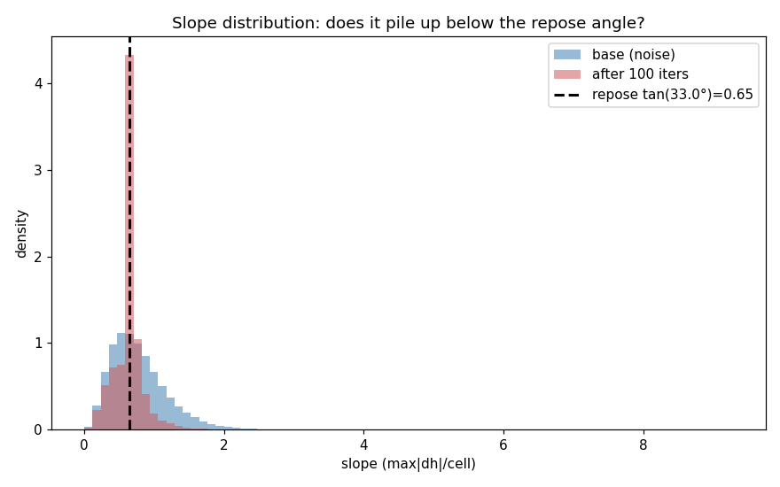
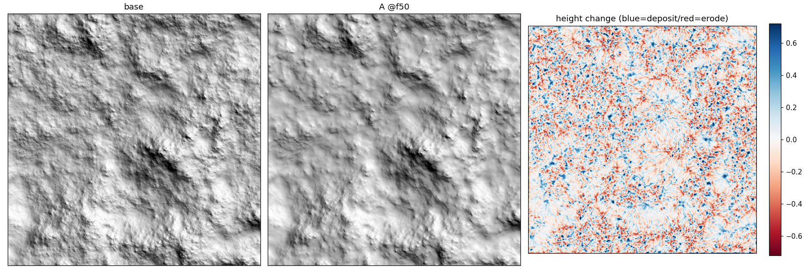
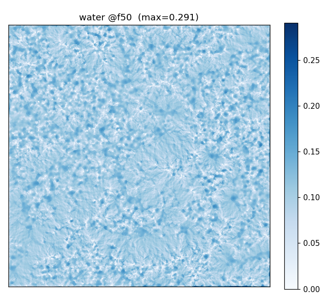
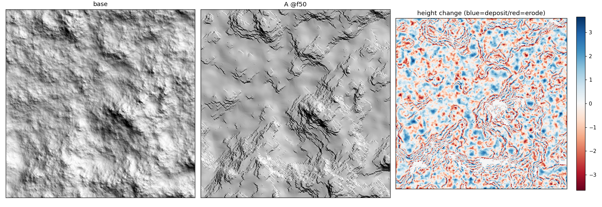
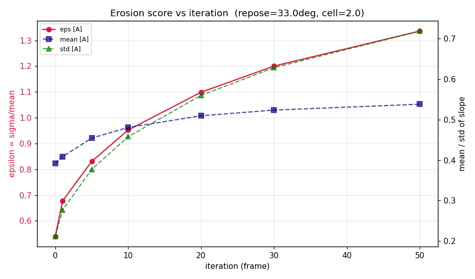

# Olsen 2004 实时程序化地形侵蚀 · 复现总结

> 论文：Jacob Olsen, *Realtime Procedural Terrain Generation* (2004) — [官方页面](http://oddlabs.com/jo/terrain/)
> 复现环境：Houdini（HeightField + Solver SOP + VEX），验证用 `hython` 离线脚本。
> 本文是我自己的实现记录与发现，不含论文原文/译文。

## 定位

这篇论文面向**电脑游戏的实时地形生成**：先快速合成分形噪声地形，再用侵蚀算法把它"做旧"成自然地貌，并提出一个量化"侵蚀程度"的**侵蚀评分 ε = σ/s̄**（坡度图的标准差 / 均值）。论文给了三套侵蚀：经典**热侵蚀**、经典**水力侵蚀**，以及一个原创的**新方法**。我把这三套都在 Houdini 里从零实现并验证了。

## 三个算法各做了什么

| 算法 | 机制 | 对地形的作用 | ε 走向 |
|------|------|------------|--------|
| **热侵蚀** | 坡度超过安息角 T 的物质沿坡下滑，堆到安息角为止 | 削平陡坡、坡度同质化成碎屑坡 | **降** |
| **水力侵蚀** | 下雨→溶解→水流搬运泥沙→蒸发沉积 | 水汇集切出河道、地形变尖锐 | **升** |
| **新方法** | 把热侵蚀条件反转：只在缓坡(0<d_max≤T)搬运、陡坡保留 | 缓坡抹成阶地、陡坎保留 | **强升** |

三者恰好诠释了论文的核心观点——"理想侵蚀地形 = 低坡度均值 + 高坡度标准差"的两个来源：**水力靠切沟造起伏，热侵蚀靠削平（但会把标准差也削掉）**，而新方法用热侵蚀的速度拿到了水力的高评分。

## 实现的关键：并行写入 → 两段式 gather

Houdini 的 Volume Wrangle 是**逐体素并行**的，每个体素只能写自己。而侵蚀本质是"把物质从 A 搬到 B"（scatter，要写邻居），并行下做不到。解法是把每次迭代拆成**两个 pass**：

1. **pass1**：每个体素只计算"我要给出多少、给哪个邻居"，存进临时层（不改高度）。
2. **pass2（gather）**：每个体素反向查"哪些邻居指着我"，把它们给我的量收过来，再扣掉自己给出的。

整条侵蚀包进 **Solver SOP** 迭代（一帧 = 一次迭代）。这个"scatter 改 gather + 两段式 + Solver"的骨架，三个算法通用，是整个复现的地基。

## 三方对照

**热侵蚀**——坡度被削到安息角，直方图在安息角处砸出尖峰（碎屑坡的签名）：

**水力侵蚀**——水自组织成树枝状河网，地形被切出沟谷：

**新方法**——缓坡被抹成阶地（平台 + 陡坎），ε 从 0.54 一路升到 1.34：

新方法的阶地不是缺陷：那些**平台**正是论文后半"游戏适用性"分析里走兵、盖房需要的平地——这也是它在论文里被选为最优的原因。

## 验证方法（守恒是不会撒谎的预言机）

每个算法都用同一套客观检验把关，工具见 [`tools/erosion_review.py`](tools/)：

- **质量守恒**：热侵蚀查 `sum(height)`、水力查 `sum(height+sediment)`（水溶解了地表、悬浮泥沙仍是物质）。三个算法最终都做到相对漂移 ~1e-8 级别。
- **ε 轨迹**：逐帧采样侵蚀评分，验证走向符合论文预期。
- **坡度直方图 / hillshade**：看形态是否对（碎屑坡 / 河道 / 阶地）。

"看着效果不错"在这种静默失败的环境里是不可信的——很多 bug 都是被守恒数字检查到的，而不是被肉眼。

## 踩过的坑（都不报错的静默失败）

Houdini 这类节点环境的坑几乎都不报错，靠对着运行态逐个量出来：

- **`chf` 引用的参数没建 / 名字不匹配 / 相对路径深度错** → 静默返回 0，整条侵蚀变空操作。
- **大小写敏感**：`@WaterN` 写不进 `waterN` 层，写入被丢弃。
- **并行别名**：先改了 `@water` 再用它当除数，导致排空格子过度扣除 → 负泥沙。
- **边界 clamp**：越界邻居钳成自己，把自己的通量当流入又收一遍 → 守恒漂移，要加自钳守卫。
- **Solver 里相对路径要多数几层**：节点从顶层挪进 Solver 后，`../x` 要变 `../../../../x`。

## 收获

- 把三个侵蚀算法从论文公式落到并行 VEX，吃透了"scatter→gather"这个在 GPU/并行环境反复出现的模式。
- 建了一套可复跑的离线验证工具，换参数/换算法一键出守恒+评分+形态三件套。
- 体会到：在节点式 DCC 里复现算法，**算法本身很少是瓶颈，工具的静默footgun才是**——所以验证脚手架要先于算法搭起来。

---

*工具与方法可复用；论文请走上方官方链接。*
