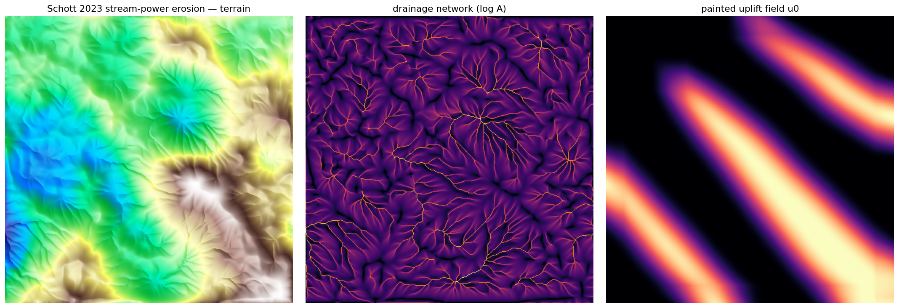

# Schott 2023 大规模地形交互式侵蚀创作 · 复现总结

> 论文：Hugo Schott, Axel Paris, Lucie Fournier, Eric Guérin, Eric Galin, *Large-scale terrain authoring through interactive erosion simulation*, ACM TOG 42(5), 2023 — [DOI 10.1145/3592787](https://doi.org/10.1145/3592787)
> 复现环境：Houdini 21（HeightField + For-Each 反馈块 + VEX Volume Wrangle），验证用 `hython` 离线脚本。
> 本文是我自己的实现记录与发现，不含论文原文/译文。

## 定位

这篇的核心思想是：**地形 = 抬升 (uplift) 与河流侵蚀的竞争**，而创作应该发生在**成因域**——你画"哪里在隆起"（抬升场 u₀），侵蚀模拟自动长出山脊与逼真水系，而不是直接捏高程。我复现了它的**侵蚀引擎**（汇水面积 + 河流功率）和**可画抬升**这半边创作机制；论文那套完整的"构造树 / 不对称基元 / 逆程序化"没做（属创作框架，非物理核心）。

## 三块拼图

| 模块 | 机制 | 论文 |
|---|---|---|
| **M1 汇水面积 a** | 迭代松弛：每格 = 自身降雨 1 + 所有**更高**邻居按坡度幂权重流入的水。**gather 方向翻转**——之前热/水力是往低处推，这里是从高处拉。 | 式3/4/5，§4.1-4.2 |
| **M2 河流功率侵蚀** | `∂h/∂t = u − sⁿaᵐ + Δh`：抬升抬高、`坡度ⁿ×汇水ᵐ` 河流下切、拉普拉斯山坡扩散磨平。显式欧拉迭代。 | 式1/2，§3-4 |
| **M4 可画抬升 u₀** | 用 HeightField Draw Mask 画抬升场 + 模糊成软穹顶，喂给侵蚀 → 画哪儿长哪儿山。 | §5-6 的最简版 |

## 关键实现：两段式 gather + 嵌套循环

- **汇水面积要拆两个 pass**：式4 的权重分母是"**邻居 j 的**下游坡度幂和"，gather 时自己算不到 → pass1 每格先存自己的下游和 `D`，pass2 再 gather。和 Olsen 水力侵蚀的 pass1/pass2 同构。
- **嵌套 For-Each**：内层把 drainage 松弛到收敛（实测 **K≈5 是拐点**，K=1 欠收敛、K=10 纯浪费），外层每步 erode 一次。
- **不守恒**：河流把物质带出域，`sum(h)` 必降——这是对的。验收不查守恒，改查**稳态收敛**（`max|Δh|→0`）+ **河网涌现**（drain 取 log 出树枝状）+ **抬升驱动**（`corr(uplift, Δh)` 强正）。

## 成品

左：着色阴影地形 | 中：树枝状河网 (log 汇水面积) | 右：手画的软抬升场 u₀。
故事链：**画抬升脊 → 隆成山 → 侵蚀沿坡切出辐射水系**。`corr(uplift,Δh)=0.97`，画哪儿就隆哪儿。

## 最大的发现：均匀抬升的天花板

一开始用**均匀抬升**测引擎，无论怎么调参（汇水迭代 K、扩散 kd、抬升 u 都扫过），地形永远是**密集均匀的细密解剖**（badlands），长不出大江大河——因为大尺度形状全由初始噪声决定、侵蚀只在表面细刻。

**大河必须靠非均匀抬升场**：把 u 换成"中心高边缘低"的穹顶/山脊，水有了一致坡向才汇集成干流（drain max 从均匀的 ~18000 升到穹顶的 ~29000）。这正是论文"在成因域创作"的全部意义——**这不是调参能翻过去的，是均匀抬升的物理天花板**。

## 踩过的坑（全是不报错的静默失败 + 工具陷阱）

- **伪代码当 VEX 粘**：算法骨架直接粘进 wrangle，不编译。
- **VEX `{}` 数组字面量只能放常量**，放 `i@ix`/变量要用 `array()`。
- **`volumeres()` 返回 `vector` 不是 `int[]`**；体素分辨率直接用绑定 `@resx/@resy` 更省。
- **两个 pass 距离单位必须一致**：pass1 用真实距离、pass2 用单位距离，权重差 `2ᵖ=16` 倍 → drain 爆。
- **`nx = i@ix + dx[k]` 但 `dx[]` 已是绝对坐标** → 索引双加 → 权重归一化破坏 → drain 爆到 1e36（每帧放大 1.74×）。
- **显式欧拉失稳**：`dt` 太大 / `m` 太大（`aᵐ` 随 a=6000 爆）→ 几帧滚成 ±inf → NaN。`dt~0.01`、`m≈n/2`。
- **`@dPdx`/`@dPdy` 在 volume wrangle 里有绑定**（= 体素世界尺寸 = gridspacing），我一开始凭印象错判成 0——该实测的没实测。
- **HF Blur 要指定 `Layer=uplift`**（默认糊 height）；模糊节点得在**主链**上、不能挂侧支预览。
- **Manual cook 模式**：视口不重算，改了看不到效果 → 一连串"为什么不起作用"全是假象，hython 强制 cook 才看到真相。改 Auto Update 解决。

## GPU 调研（留作将来）

想学 HF Erode 的 GPU 速度：**v3.0 是新 Copernicus COP 框架 + 33 个 OpenCL kernel**（不是 SOP OpenCL，cook 后才展开，内部一个 `copnet`）；**v2.0 才有可直接看的 OpenCL SOP**。要把本侵蚀港到 GPU = 在 copnet 里用 `@KERNEL/@ixy/@layer.bufferIndex/@WRITEBACK` 重写——COP 是一整个新上下文，独立项目，本次未做。`tools/` 留了 drainage gather 的 COP OpenCL kernel 草稿。

## 收获

- 吃透了地形领域那个最大的概念——**汇水面积驱动的河流侵蚀**，把侵蚀理解从"局部安息角/管道"补齐到"大尺度水系成因"。
- 验证了论文的核心论断：**好地形要在成因域（抬升）创作，不在结果域（高程）**——均匀抬升的天花板亲手撞过。
- 再次确认：节点式 DCC 里复现算法，**算法本身很少是瓶颈，工具的静默 footgun（不报错、不更新、类型不符）才是**；离线 hython 验证脚手架必须先于算法搭。

---

*工具与方法可复用；论文请走上方官方链接。*
